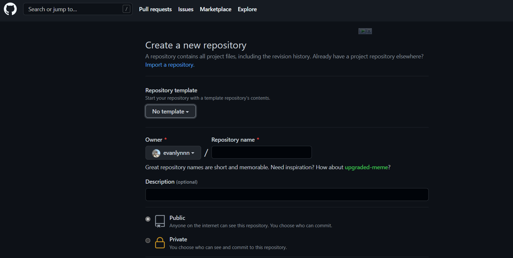
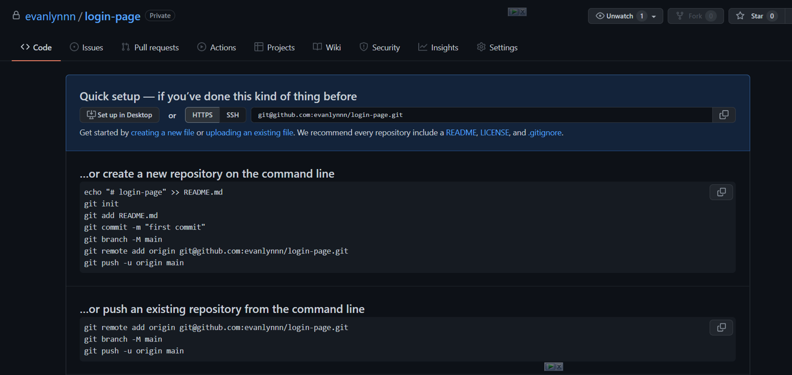
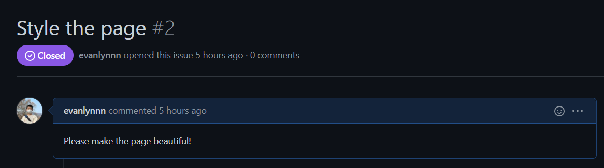
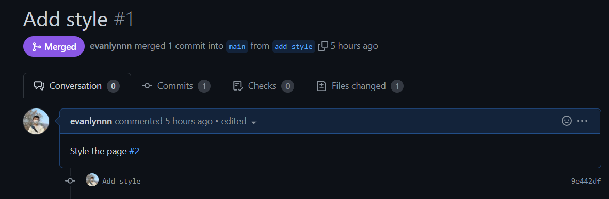

# Demo Project Login Page、

以登录页面为例，向大家演示使用GitHub完成小组作业。

# 配置用户信息

在使用Git前，你需要先配置用户信息。用户信息会记录在项目的更新日志中。

```bash
$ git config --global user.name "Wenwei Lin"
$ git config --global user.email "evanlynn.wei@gmail.com"
```

## 创建项目目录并初始化

在进行每一个Git项目时，我们都需要使用`git init`命令初始化。

```bash
$ mkdir login   # 创建login目录
$ cd login      # 移动到login目录
$ git init      # 初始化

Initialized empty Git repository in /home/evanlynn/workshop/login/.git/
```

## 在项目中创建文件README.md

`README.md`文件是显示在GitHub仓库页面的文件，我们将创建它作为项目的第一个文件。

```bash
$ touch README.md # 创建README.md文件
$ ls              # 查看当前目录文件

README.md
```

## 查看repo状态

`git status`命令将显示项目状态。

```bash
$ git status

On branch master

No commits yet

Untracked files:
  (use "git add <file>..." to include in what will be committed)
        README.md

nothing added to commit but untracked files present (use "git add" to track)
```

## 添加到Git缓冲区

将`README.md`文件添加到缓冲区中

```bash
$ git add README.md # 添加到缓冲区
$ git status        # 再次查看项目状态

On branch master

No commits yet

Changes to be committed:
  (use "git rm --cached <file>..." to unstage)
        new file:   README.md
```

## Commit changes

当完成修改后，提交这次改变。（备份点）

```bash
$ git commit -m "Initialize the repo"

[master (root-commit) 85c0904] Initialize the repo
 1 file changed, 0 insertions(+), 0 deletions(-)
 create mode 100644 README.md
```

## 查看提交日志

`git log`命令可以让我们查看仓库的提交日志

```bash
$ git log

commit 85c09049ef2081c1c4301e45847f3dcc04d82441 (HEAD -> master)
Author: Wenwei Lin <evanlynn.wei@gmail.com>
Date:   Fri Apr 1 14:00:16 2022 +0800

    Initialize the repo
```

如果想要获得更精简的日志，使用`git log --oneline`命令

```bash
$ git log --oneline

85c0904 (HEAD -> master) Initialize the repo
```

## 在README.md文件中加入内容

```bash
$ code . # 使用Visual Studio Code打开项目
```

在README.md中描述项目

```bash
# Awesome Login Page

这个项目将搭建一个登录页面。用户可以输入账户、密码。
```

## 对比文件变化

`git diff`命令可以帮助我们对比文件的变化

```bash
$ git diff

diff --git a/README.md b/README.md
index e69de29..08ef9e0 100644
--- a/README.md
+++ b/README.md
@@ -0,0 +1,3 @@
+# Awesome Login Page
+
+这个项目将搭建一个登录页面。用户可以输入账户、密码。
\ No newline at end of file
```

## 提交改变

当完成某一个阶段的任务时，我们可以使用`git commit`命令提交变化，相当于一个备份点。

```bash
$ git commit -a -m "Write project introduction in README.md"

[master d14b148] Write project introduction in README.md
 1 file changed, 3 insertions(+)
```

提交完成后，我们再次查看日志

```bash
$ git log --oneline

d14b148 (HEAD -> master) Write project introduction in README.md
85c0904 Initialize the repo
```

## 忽略某些文件

有时候，本地项目的某些文件是不需要（不能）推送到仓库中的，比如环境变量`.env`文件。

这时候，我们可以使用`.gitignore`文件注明哪些文件不需要跟踪。

```bash
$ touch .env # 创建文件.env
$ git status # 查看repo状态

On branch master
Untracked files:
  (use "git add <file>..." to include in what will be committed)
        .env

nothing added to commit but untracked files present (use "git add" to track)
```

```bash
$ touch .gitignore # 创建.gitignore文件
$ git status       # 查看repo状态

On branch master
Untracked files:
  (use "git add <file>..." to include in what will be committed)
        .env
        .gitignore

nothing added to commit but untracked files present (use "git add" to track)
```

在`.gitignore`文件中加入以下内容

```bash
.env
```

再次检查repo状态，此时已经不显示`.env`文件了

```bash
$ git status

On branch master
Untracked files:
  (use "git add <file>..." to include in what will be committed)
        .gitignore

nothing added to commit but untracked files present (use "git add" to track)
```

下面提交文件

```bash
$ git add .
$ git commit -m "Specify .gitignore"

[master 7c879e8] Specify .gitignore
 1 file changed, 1 insertion(+)
 create mode 100644 .gitignore
```

查看仓库状态

```bash
$ git status

On branch master
nothing to commit, working tree clean
```

## 修正小错误

有时候，我们发现上一次的提交中包含小错误，比如拼错了单词，目录名写错了，但又不想再提交一次。

这时，可以使用`--amend`命令修改历史。

我们加入一段包含错误的内容

```bash
你可以在inde.html中查看代码
```

提交这次改变

```bash
$ git commit -a -m "Add more details in README.md"

[master 5162724] Add more details in README.md
 1 file changed, 3 insertions(+), 1 deletion(-)
```

修正错误

```bash
你可以在index.html中查看代码
```

使用`git commit --amend`修改历史，不改变本次提交

```bash
$ git add .
$ git commit --amend --no-edit

[master a9399ea] Add more details in README.md
 Date: Fri Apr 1 14:28:03 2022 +0800
 1 file changed, 3 insertions(+), 1 deletion(-)
```

检查历史记录

```bash
$ git log --oneline

edebff0 (HEAD -> master) Add more details in README.md
7c879e8 Specify .gitignore
d14b148 Write project introduction in README.md
85c0904 Initialize the repo
```

## 恢复删除的文件

有时，我们不小心删除了文件。Git可以帮我们恢复文件

```bash
$ rm README.md
$ ls

```

`git checkout`命令可以帮我们从缓存区恢复文件

```bash
$ git checkout -- README.md
$ ls

README.md
```

## 创建分支

首先我们先创建`index.html`文件，并完成html框架

```bash
$ touch index.html
$ code .
```

```bash
<!DOCTYPE html>
<html lang="zh-cn">

<head>
    <title>登录页面</title>
</head>

<body>
    <h1>登录页面</h1>
</body>

</html>
```

提交变化

```bash
$ git add .
$ git commit -m "Create index.html"
```

创建一个名为`build-form`的分支，我们将在其中添加一个表单

```bash
$ git checkout -b build-form

Switched to a new branch 'build-form'
```

通过`git branch`命令可以查看当前的分支

```bash
$ git branch

* build-form
  master
```

将`index.html`修改为

```bash
<!DOCTYPE html>
<html lang="zh-cn">

<head>
    <title>登录页面</title>
</head>

<body>
    <h1>登录页面</h1>
    <div id="form">
        <form id="login-form" method="get" action="#">
            <div>
                <label for="username">用户名:</label>
                <input type="text" id="username">
            </div>
            <div>
                <label for="password">密码:</label>
                <input type="password" id="password">
            </div>
            <input type="submit" class="form-button" value="提交">
        </form>
    </div>
</body>

</html>
```

```bash
$ git commit -a -m "build form"

[build-form aaa1baa] build form
 1 file changed, 13 insertions(+)
```

## 合并分支

完成了特性开发后，我们切换到主分支，将`build-form`分支合并

```bash
$ git checkout master
$ git merge --no-ff build-form

Merge made by the 'recursive' strategy.
 index.html | 13 +++++++++++++
 1 file changed, 13 insertions(+)
```

查看日志

```bash
$ git log --oneline

7819a62 (HEAD -> master) Merge branch 'build-form'
aaa1baa (build-form) build form
0050a3c Create index.html
a9399ea Add more details in README.md
7c879e8 Specify .gitignore
d14b148 Write project introduction in README.md
85c0904 Initialize the repo
```

以图的形式显示日志

```bash
$ git log --graph

*   commit 7819a6247f34c8c976b0f8cfa998dbdc88886eab (HEAD -> master)
|\  Merge: 0050a3c aaa1baa
| | Author: Wenwei Lin <evanlynn.wei@gmail.com>
| | Date:   Fri Apr 1 15:55:48 2022 +0800
| |
| |     Merge branch 'build-form'
| |
| * commit aaa1baa32b3df06f9dd1a8abadb3601af977c1c7 (build-form)
|/  Author: Wenwei Lin <evanlynn.wei@gmail.com>
|   Date:   Fri Apr 1 15:54:34 2022 +0800
|
|       build form
|
* commit 0050a3ce7ccfc307d99a38068a903113f67b204a
| Author: Wenwei Lin <evanlynn.wei@gmail.com>
| Date:   Fri Apr 1 15:34:58 2022 +0800
|
|     Create index.html
|
...
```

分支开发完成并合并后，可以使用`git branch -d`删除分支。

```bach
$ git branch -d build-form
```


## 向GitHub推送本地仓库

先进入GitHub创建仓库，然后推送。





## 使用GitHub协同工作

### 创建一个Issue



### Tom负责完成这个工作

创建一个新目录

```bash
$ cd ..
$ mkdir tom
$ cd tom
```

克隆仓库到本地

```bash
$ git clone <repo_url>

Cloning into 'Login'...
remote: Enumerating objects: 19, done.
remote: Counting objects: 100% (19/19), done.
remote: Compressing objects: 100% (11/11), done.
remote: Total 19 (delta 4), reused 19 (delta 4), pack-reused 0
Receiving objects: 100% (19/19), done.
Resolving deltas: 100% (4/4), done.
```

进入目录，使用VS Code打开

```bash
cd Login
code .
```

新建一个`add-style`分支

```bash
$ git checkout -b add-style

Switched to a new branch 'add-style'
```

加入CSS

```bash
<!DOCTYPE html>
<html lang="zh-cn">

<head>
    <title>登录页面</title>
    <style>
        .form {
            position: relative;
            background: #FFFFFF;
            max-width: 30%;
            margin: auto;
            padding: 45px;
            text-align: center;
            box-shadow: 0 0 20px 0 rgba(0, 0, 0, 0.2), 0 5px 5px 0 rgba(0, 0, 0, 0.24);
        }

        input {
            outline: 0;
            background: #f2f2f2;
            width: 100%;
            border: 0;
            margin: 0 0 15px;
            padding: 15px;
            box-sizing: border-box;
            font-size: 14px;
        }

        .form-button {
            font-family: "Roboto", sans-serif;
            text-transform: uppercase;
            outline: 0;
            background: #4CAF50;
            width: 100%;
            border: 0;
            padding: 15px;
            color: #FFFFFF;
            font-size: 14px;
            -webkit-transition: all 0.3 ease;
            transition: all 0.3 ease;
            cursor: pointer;
        }
    </style>
</head>

<body>
    <h1>登录页面</h1>
    <div id="form">
        <form id="login-form" method="get" action="#">
            <div>
                <label for="username">用户名:</label>
                <input type="text" id="username">
            </div>
            <div>
                <label for="password">密码:</label>
                <input type="password" id="password">
            </div>
            <input type="submit" class="form-button" value="提交">
        </form>
    </div>
</body>

</html>
```

提交变化

```bash
$ git commit -a -m "Add style"
[add-style ec30373] Add style
 1 file changed, 62 insertions(+), 22 deletions(-)
 rewrite index.html (94%)
```

合并到主分支。

注意，此时的主分支是main！

```bash
$ git checkout main
$ git merge --no-ff add-style

Merge made by the 'recursive' strategy.
 index.html | 78 +++++++++++++++++++++++++++++++++++++++++++++++++++++++++++-------------------
 1 file changed, 59 insertions(+), 19 deletions(-)
```

推送到远程的`add-style`分支

```bash
$ git push origin add-style

Enumerating objects: 5, done.
Counting objects: 100% (5/5), done.
Delta compression using up to 8 threads
Compressing objects: 100% (3/3), done.
Writing objects: 100% (3/3), 868 bytes | 868.00 KiB/s, done.
Total 3 (delta 1), reused 0 (delta 0)
remote: Resolving deltas: 100% (1/1), completed with 1 local object.
remote:
remote: Create a pull request for 'add-style' on GitHub by visiting:
remote:      https://github.com/evanlynnn/Login/pull/new/add-style
remote:
To github.com:evanlynnn/Login.git
 * [new branch]      add-style -> add-style
```

在GitHub中发送一个Pull Request，并合并分支

